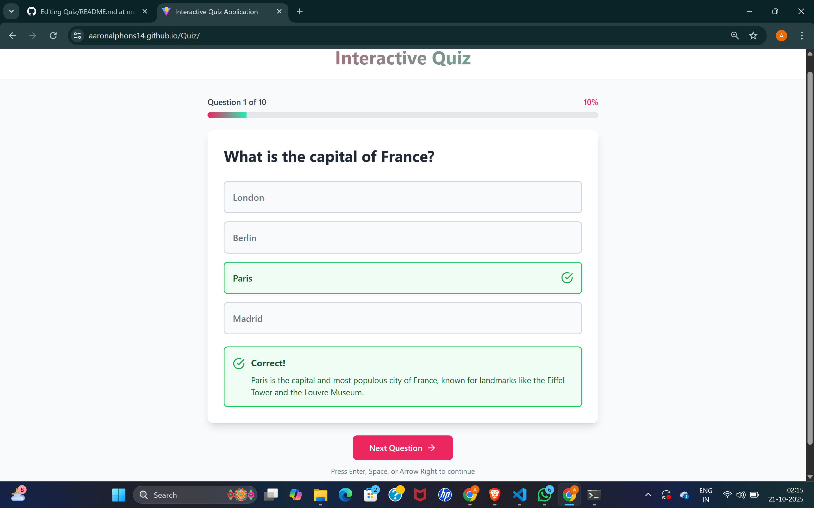
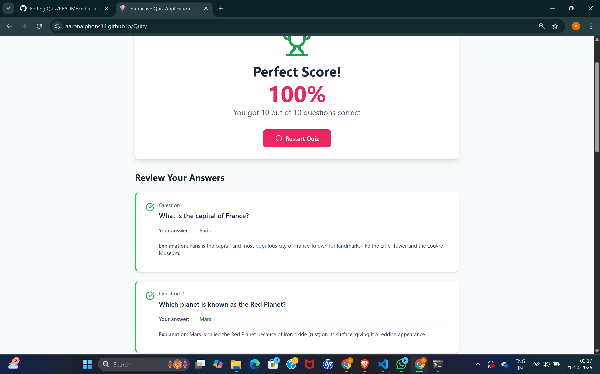
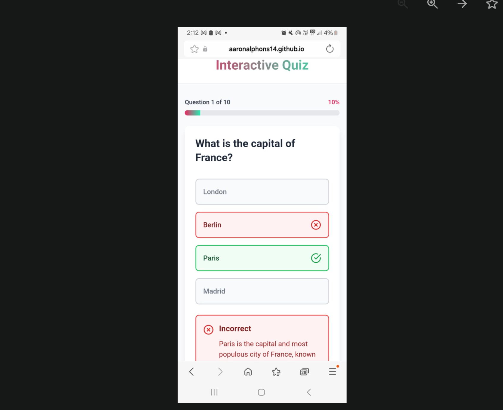
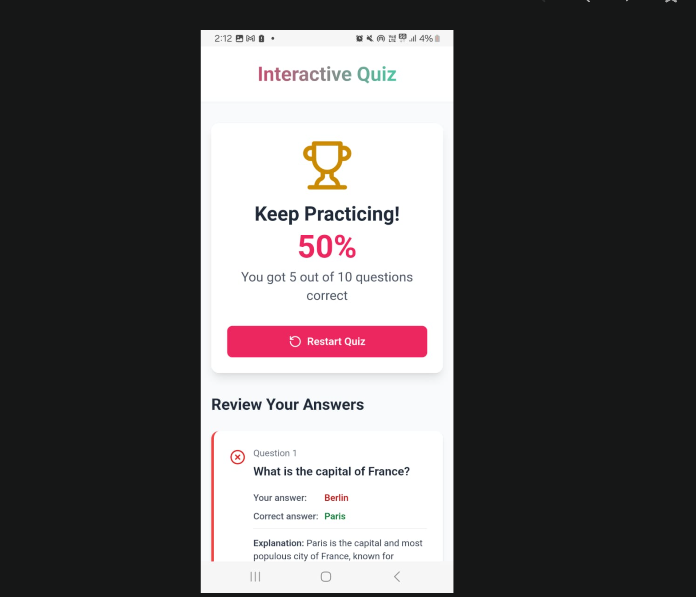

🎯 Quiz App

A responsive, interactive quiz application that allows users to test their knowledge with multiple-choice questions. Built with React, TypeScript, and Vite, this app provides a smooth user experience across both desktop and mobile devices.

🌟 Features

✅ Responsive Design – Works perfectly on desktops, tablets, and mobiles.

✅ Dynamic Quiz Questions – Questions can be updated easily.

✅ Instant Feedback – Users get immediate scoring results after completing the quiz.

✅ Clean & Intuitive UI – Focus on a simple and engaging user experience.

✅ Easy Navigation – Intro page leads to main quiz seamlessly.

🖥️ Screenshots

Desktop View

Mobile View

🛠️ Tech Stack

React – Frontend library for building user interfaces.

TypeScript – Adds type safety and improves code quality.

Vite – Fast development server and build tool.

Tailwind CSS – Utility-first styling framework for clean design.
